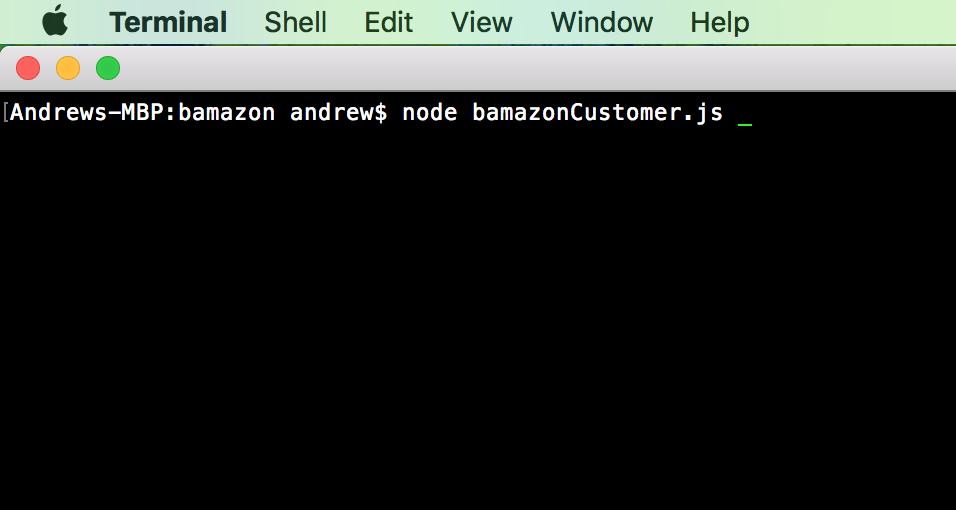
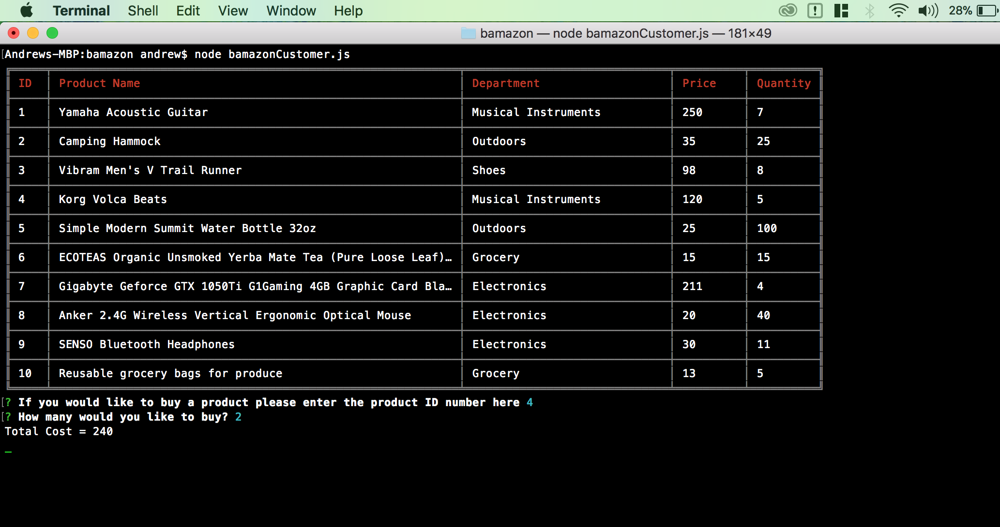
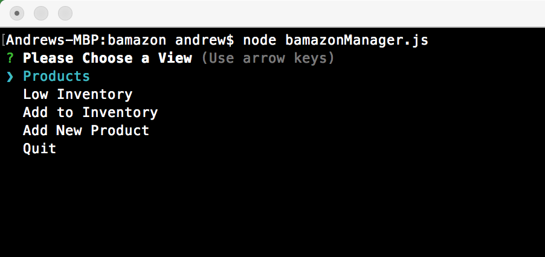
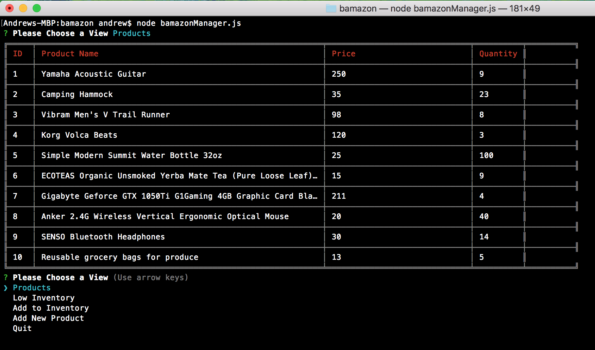
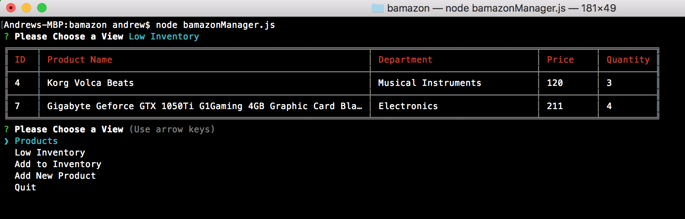
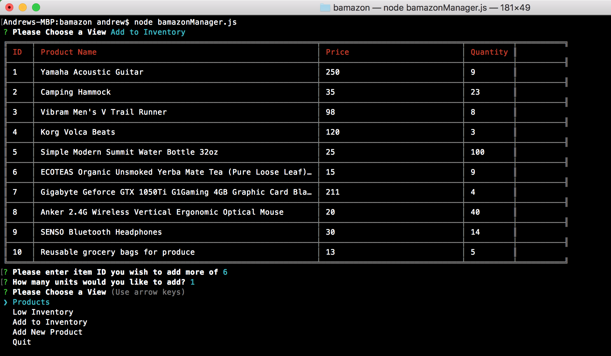
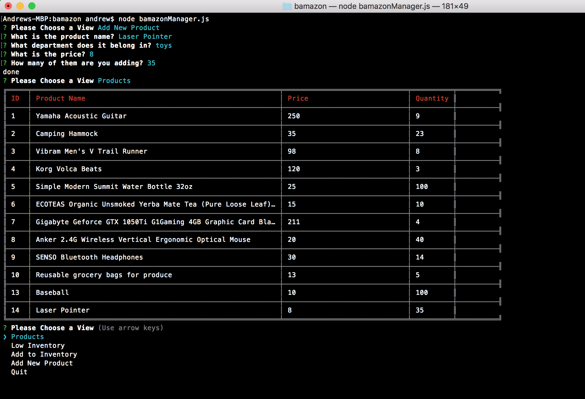

# Bamazon

## About
This is an Amazon clone built for use in the bash and utilizes mysql to store
its data. There are two different files which offer different functionality
1. bamazonCustomer.js is used to view the store and place orders
2. bamazonManager.js is used to manager the store.

## Setup
1. Clone the repo by typing `git clone https://github.com/Afellman/bamazon.git` into your bash.
2. Install the necessary node packages by typing `npm install` from inside the repo directory.

## Using The Customer App

To run the customer version, type `node bamazonCustomer.js` into your bash from
inside the repo directory.

You will then be prompted with two questions about your purchase, followed by a 
confirmation and a total cost. 

## Using The Manager App

To run the manager version, type `node bamazonManager.js` into your bash from
inside the repo directory.
You will then be present with a series of options to choose from.

1. Products - Shows all the products currently in the store.

2. Low Inventory - Shows all the products with inventory less than 5.

3. Add To Inventory - Allows you to add units of an already exsisting product.

4. Add New Product - Allows you to add a completely new product.

